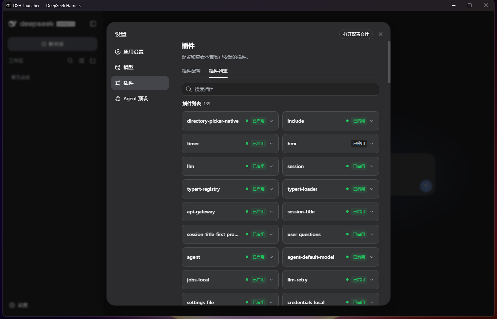
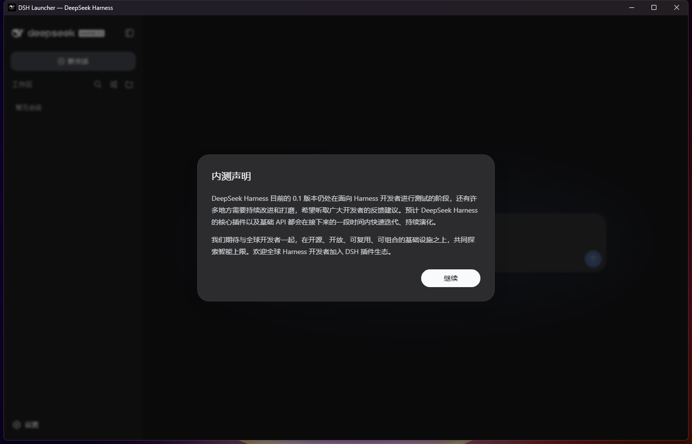
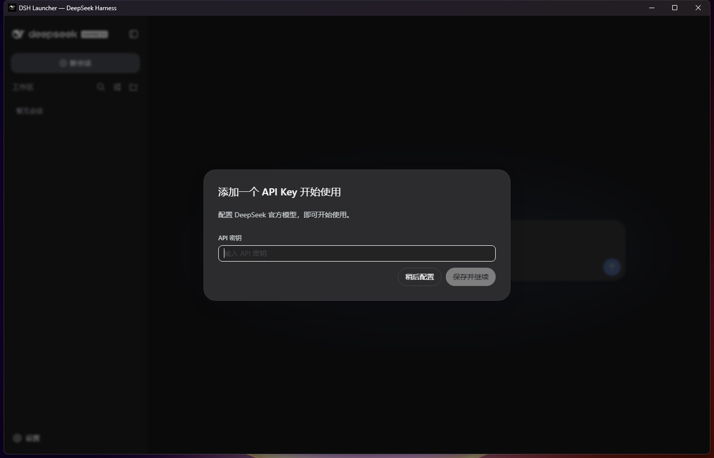
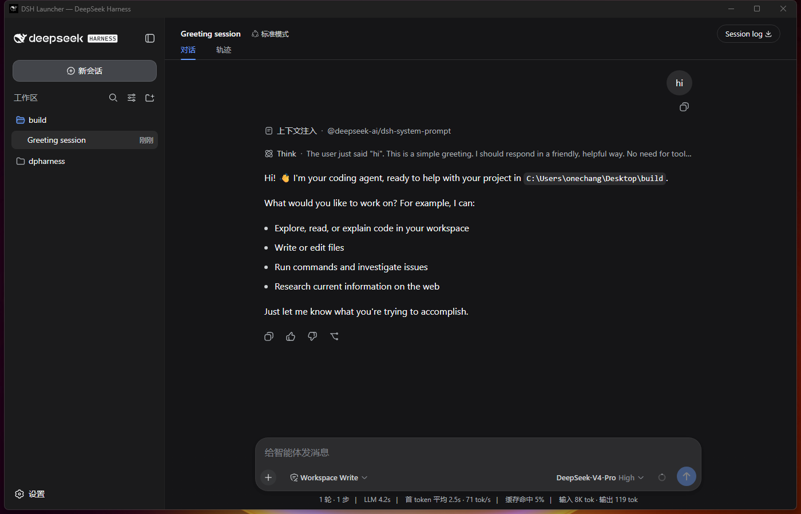

<h1 align="center">DSH Launcher</h1>

<p align="center">
  <strong>An open-source desktop launcher for DeepSeek Harness on Windows and macOS.</strong><br>
  No Node.js install, no command line — double-click to launch the full DeepSeek Harness Web GUI in a native window.<br>
  Zero upstream changes: it is a thin desktop shell over the official runtime.
</p>

<p align="center"><sub>
  An independent community open-source project. It has no affiliation, partnership, endorsement,
  or sponsorship relationship with DeepSeek.<br>
  This repository is maintained independently by the community; no DeepSeek employees or
  DeepSeek Harness upstream team members are involved.<br>
  <a href="README.md">中文</a> · English
</sub></p>

<p align="center">
  <a href="LICENSE"></a>
  
  <a href="https://github.com/panic77ak/deepseek-harness-launcher"></a>
</p>

<p align="center">
  
</p>

<p align="center">
  
</p>

<p align="center">
  
</p>

<p align="center">
  
</p>

DSH Launcher wraps the local Web GUI of [DeepSeek Harness](https://github.com/deepseek-ai/deepseek-harness) in a native desktop window. It does **not modify or re-implement upstream code**: the backend runs the official `@deepseek-ai/dsh` npm package, and the desktop shell only boots it, waits for it to become ready, and hosts its Web UI in a native window.

## Download & Install

Official installers are available for Windows x64 and macOS (Apple Silicon). No extra environment needed — download, install, done.

| Platform | Download | Install |
| --- | --- | --- |
| Windows x64 | [Download installer](https://github.com/panic77ak/deepseek-harness-launcher/releases/download/v0.1.0/DSH.Launcher-Setup-0.1.0-x64.exe) | Run the NSIS installer and follow the prompts |
| Windows x64 (portable) | [Download portable](https://github.com/panic77ak/deepseek-harness-launcher/releases/download/v0.1.0/DSH.Launcher-Portable-0.1.0-x64.exe) | No install; double-click to run (first launch self-extracts for a few minutes) |
| macOS arm64 (Apple Silicon) | [Download DMG](https://github.com/panic77ak/deepseek-harness-launcher/releases/download/v0.1.0/DSH.Launcher-0.1.0-arm64.dmg) | Open the DMG and drag DSH Launcher into Applications |

> The macOS build is **unsigned and un-notarized**; first open needs right-click → Open to bypass Gatekeeper.
> Intel Mac (x64) is not provided yet; please open an issue if you need it.

No extra environment needed: the backend runs on the Node.js runtime bundled inside the app, so **Node.js is not required** on the target machine.

## Features

- **Zero runtime dependency**: runs the dsh backend with Electron's bundled Node (`ELECTRON_RUN_AS_NODE`); users need no Node install.
- **Zero upstream changes**: the backend is the official npm package `@deepseek-ai/dsh`; the shell never patches or forks upstream.
- **Port auto-adaptation**: boot on 3080 if free; reuse an existing dsh web on 3080; otherwise let the OS pick a free port.
- **Single instance**: re-launching focuses the existing window instead of starting a second backend.
- **Privacy built-in**: the app **never packages any API keys or credentials**; they live only in your local `~/.dsh`.

## Relationship with DeepSeek Harness

DSH Launcher is an **independent community project** built on [DeepSeek Harness](https://github.com/deepseek-ai/deepseek-harness).

This repository is maintained independently by the community, and no DeepSeek employees or DeepSeek Harness upstream team members are involved in its development, maintenance, or governance. This repository has no affiliation, partnership, endorsement, or sponsorship relationship with DeepSeek.

The upstream project provides the core agent capabilities, plugin system, and Web UI; DSH Launcher only provides:

- Desktop packaging (Electron window)
- Local dsh backend boot, readiness wait, and exit cleanup
- Windows / macOS installer builds and releases
- Port policy and single-instance management

To run DeepSeek Harness from the command line, or to contribute to its core development, please go to the [upstream repository](https://github.com/deepseek-ai/deepseek-harness) first.

## How It Works

```
┌────────────────────────────────┐
│  DSH Launcher (Electron 39)    │
│  ┌──────────────────────────┐  │
│  │  BrowserWindow           │  │  loads http://127.0.0.1:<port>
│  │  (full Web GUI)          │  │
│  └──────────────────────────┘  │
│  │  spawn (ELECTRON_RUN_AS_NODE) │
│  └───────────┬────────────────┘  │
└──────────────┼───────────────────┘
               ▼
   dsh web backend (npm @deepseek-ai/dsh)
   binds 127.0.0.1:3080, injects window.__DSH_BOOT__
```

- The backend runs on **Electron's bundled Node** with `--expose-internals`, satisfying dsh's HMR service requirement for Node internal module access.
- Port policy: 3080 free → boot; 3080 already a dsh web → reuse; taken by something else → OS-assigned free port.
- Single instance: re-launching only focuses the existing window.

## Development

Prerequisites: Node.js ≥ 22.19 (or ≥ 24), npm.

```bash
# 1. Install desktop shell dependencies (electron, etc.)
npm install

# 2. Prepare the backend: install the public @deepseek-ai/dsh into backend/
npm run prepare:backend

# 3. Run
npm start
```

## Building Installers

```bash
npm run dist:win       # Windows: NSIS installer + portable exe (dist/)
npm run dist:mac       # macOS: dmg + zip (must run on macOS)
npm run dist:dir       # unpacked directory only (faster, for debugging)
```

> Cross-platform note: electron-builder builds artifacts for the **current** platform.
> macOS dmg/zip must be built on macOS; Windows NSIS/portable must be built on Windows.

## Environment Variables

| Variable | Description |
| --- | --- |
| `DSH_DESKTOP_PORT` | Preferred backend port, default `3080` |
| `DSH_HOME` | dsh data directory (credentials/sessions/settings), default `~/.dsh`, read by dsh itself |
| `DSH_DESKTOP_DEBUG` | When set, writes a startup log to `startup.log` in the user data directory |

## Open-Source Notes

- `backend/` and `node_modules/` are in `.gitignore` and rebuilt by `npm run prepare:backend` — **do not commit them**.
- **Credential audit (done)**: this repository's source contains no real API keys — scanned for `sk-xxxx` long tokens
  and `api_key`/`credential`/`secret`/`token` fields; only privacy-note comments matched.
  Real credentials live only in the user's local `~/.dsh`, unrelated to this repository.
- Re-check before committing (from the repository root):

  ```powershell
  Get-ChildItem . -Recurse -File -Include *.yaml,*.yml,*.json,*.js,*.mjs |
    Where-Object { $_.FullName -notmatch '\\node_modules\\|\\backend\\|\\dist\\' } |
    Select-String -Pattern 'sk-[A-Za-z0-9]{20,}'
  ```

- This app is only a shell; it does not modify dsh itself. Licenses of dsh and its dependencies are in their respective npm packages.

## Acknowledgments

Special thanks to the [DeepSeek Harness repository](https://github.com/deepseek-ai/deepseek-harness) and the DeepSeek AI team.
DSH Launcher is built on the upstream npm package; the core agent, models, tools, sessions, and Web UI all come from that project.

Thanks also to the [Cordis](https://github.com/cordiverse/cordis) project for the plugin foundation, and to sibling community projects such as
[anywhere-labs/deepseek-harness-desktop](https://github.com/anywhere-labs/deepseek-harness-desktop) for inspiration.

## License

This project is licensed under the [MIT License](LICENSE).

> "DeepSeek Harness" is a trademark of DeepSeek. The name is used here solely to accurately describe the technical origin, compatibility, and relationship with the upstream software.

> This project is completely free and open source. If anyone tries to sell this software to you in any form, please decline.

> DSH Launcher is an independent community project with no affiliation, partnership, endorsement, or sponsorship relationship with DeepSeek.
