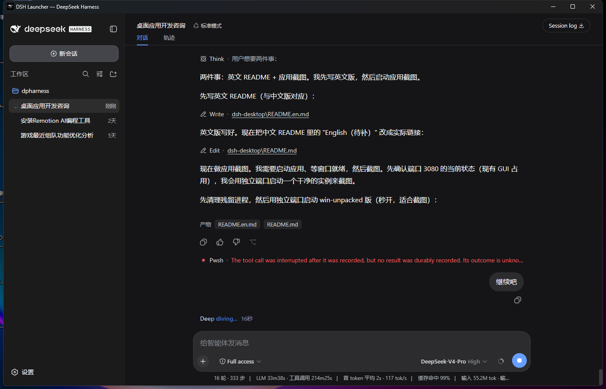

<h1 align="center">DSH Launcher</h1>

<p align="center">
  <strong>基于 DeepSeek Harness 构建的 Windows 与 macOS 开源桌面启动器。</strong><br>
  无需安装 Node.js、无需手动敲命令，双击即可在原生窗口里启动完整的 DeepSeek Harness Web GUI。<br>
  对上游零改动：只做一层「桌面外壳」。
</p>

<p align="center"><sub>
  独立的社区开源项目，与深度求索（DeepSeek）不存在隶属、合作、授权或背书关系。<br>
  本仓库由社区独立维护，不含 DeepSeek Harness 上游官方团队成员参与。<br>
  中文 · <a href="README.en.md">English</a>
</sub></p>

<p align="center">
  <a href="LICENSE"></a>
  
  <a href="https://github.com/panic77ak/deepseek-harness-launcher"></a>
</p>

<p align="center">
  
</p>

DSH Launcher 把 [DeepSeek Harness](https://github.com/deepseek-ai/deepseek-harness) 的本地 Web GUI 装进原生桌面窗口。它**不修改、不复刻上游源码**：后端直接运行 npm 上发布的官方 `@deepseek-ai/dsh` 包，桌面壳负责启动它、等它就绪、再用一个原生窗口承载它的 Web 界面。

## 下载与安装

> 当前阶段：安装包由 GitHub Actions 自动构建，产物可在对应 workflow run 的 Artifacts 里下载。
> 正式发布（Releases）将随 `v*` tag 产出。

| 平台 | 产物 | 说明 |
| --- | --- | --- |
| Windows x64 | `DSH Launcher-Setup-0.1.0-x64.exe` | NSIS 安装包，装一次之后秒开 |
| Windows x64 | `DSH Launcher-Portable-0.1.0-x64.exe` | 免安装便携版，首次启动需自解压几分钟 |
| macOS arm64 / x64 | `DSH Launcher-0.1.0-*.dmg` / `-*.zip` | 未签名、未公证，首次打开需「右键 → 打开」绕过 Gatekeeper |

无需额外环境：后端由应用自带的 Node.js 运行时启动，目标机器**不需要安装 Node.js**。

## 主要特性

- **零运行时依赖**：用 Electron 内置的 Node（`ELECTRON_RUN_AS_NODE`）直接运行 dsh 后端，用户无需装 Node。
- **对上游零改动**：后端是 npm 官方包 `@deepseek-ai/dsh`，桌面壳不 patch、不 fork 上游代码。
- **端口自适应**：3080 空闲则自启后端；3080 已被 dsh web 占用则直接复用；被其他程序占用则让系统分配空闲端口。
- **单实例**：重复启动会聚焦已有窗口，不会起第二个后端抢端口。
- **隐私内建**：应用**不打包任何用户的 API Key 或凭据**；凭据始终只存于你本机的 `~/.dsh`。

## 与 DeepSeek Harness 的关系

DSH Launcher 是基于 [DeepSeek Harness](https://github.com/deepseek-ai/deepseek-harness) 构建的**独立社区项目**。

本仓库由社区独立维护，目前不存在深度求索员工或 DeepSeek Harness 上游官方团队成员参与本项目开发、维护或治理的情形。本仓库与深度求索（DeepSeek）不存在隶属、合作、授权或背书关系。

上游项目提供核心的智能体能力、插件系统与 Web UI；DSH Launcher 只负责：

- 桌面应用封装（Electron 窗口）
- 本地 dsh 后端的启动、等待就绪与退出清理
- Windows / macOS 安装包构建与发布
- 端口策略与单实例管理

如果你想通过命令行运行 DeepSeek Harness，或参与其核心功能开发，请优先前往[上游仓库](https://github.com/deepseek-ai/deepseek-harness)。

## 原理

```
┌────────────────────────────────┐
│  DSH Launcher (Electron 39)    │
│  ┌──────────────────────────┐  │
│  │  BrowserWindow           │  │  打开 http://127.0.0.1:<port>
│  │  (完整 Web GUI)           │  │
│  └──────────────────────────┘  │
│  │  spawn (ELECTRON_RUN_AS_NODE) │
│  └───────────┬────────────────┘  │
└──────────────┼───────────────────┘
               ▼
   dsh web 后端（npm 安装的 @deepseek-ai/dsh）
   绑定 127.0.0.1:3080，注入 window.__DSH_BOOT__
```

- 后端用 **Electron 自带的 Node** 运行，启动参数带 `--expose-internals`，满足 dsh HMR 服务对 Node 内部模块的访问要求。
- 端口策略：3080 空闲 → 自启；3080 已被 dsh web 占用 → 复用；被其他程序占用 → 系统分配空闲端口。
- 单实例：重复启动只会聚焦已有窗口。

## 开发运行

前置：Node.js ≥ 22.19（或 ≥ 24）、npm。

```bash
# 1. 安装桌面外壳依赖（electron 等）
npm install

# 2. 准备后端：把公开的 @deepseek-ai/dsh 装进 backend/
npm run prepare:backend

# 3. 启动
npm start
```

## 打包安装包

```bash
npm run dist:win       # Windows：NSIS 安装包 + 便携版 exe（dist/ 目录）
npm run dist:mac       # macOS：dmg + zip（需在 macOS 上执行）
npm run dist:dir       # 仅生成未打包目录（调试用，较快）
```

> 跨平台说明：electron-builder 打包**当前平台**的产物。macOS 的 dmg/zip 需在 macOS 上构建；
> Windows 的 NSIS/portable 需在 Windows 上构建。建议用 GitHub Actions 矩阵分别出包（见下）。

## GitHub Actions 自动出包

`.github/workflows/release.yml` 用 `windows-latest` / `macos-latest` 矩阵自动产出双平台安装包：

- **触发**：手动（Actions 页面 → Run workflow），或 push 带 `v*` 前缀的 tag（如 `v0.1.0`）。
- **流程**：每个 runner 独立执行 `npm ci` → `npm run prepare:backend`（按平台安装后端原生依赖）
  → 平台分支打包（Windows 走 `dist:win`，macOS 走 `dist:mac`）→ 上传 artifact。

> 为什么 `prepare:backend` 必须在每个平台各自跑：后端依赖里的原生包
> （如 `node-addon-require-builtin`）通过 npm 的 optionalDependencies 按平台选择，
> 跨平台复用同一份 `backend/` 会装错原生二进制。

> **macOS 签名/公证**：当前 CI 产出的是**未签名、未公证**的 dmg（仓库不配置
> Apple Developer ID 与 notarization 密钥）。首次打开需「右键 → 打开」绕过 Gatekeeper。
> 正式对外分发需另配 Apple 开发者证书与 notarization secrets——这是后续待办。

## 更换应用图标

`build/` 目录下的 `icon.ico`（Windows）、`icon.icns`（macOS）、`icon.png`（通用）由源图生成。要换图标：

```powershell
# Windows（PowerShell）
powershell -ExecutionPolicy Bypass -File scripts/make-icons.ps1 -SourceImage <你的图片路径>
```

脚本会把源图居中裁剪成方形，生成全部三种格式。之后重新 `npm run dist:win` / `dist:mac` 即可。

## 环境变量 / 参数

| 项 | 说明 |
| --- | --- |
| `DSH_DESKTOP_PORT` | 后端首选端口，默认 `3080` |
| `DSH_HOME` | dsh 数据目录（凭据/会话/设置），默认 `~/.dsh`，由 dsh 自身读取 |
| `DSH_DESKTOP_DEBUG` | 设为任意值后把启动日志写入用户数据目录 `startup.log`，便于排查 |

## 开源注意事项

- `backend/` 与 `node_modules/` 已在 `.gitignore` 中，由 `npm run prepare:backend` 重建，**不要提交**。
- **凭据自查（已执行）**：本项目源码不含任何真实 API key——已扫描 `sk-xxxx` 长 token 与
  `api_key`/`credential`/`secret`/`token` 敏感字段，仅命中注释里的隐私说明文字。
  真实凭据只在用户本机 `~/.dsh`，与本仓库无关。
- 提交前可用这条命令复核（仓库根目录执行）：

  ```powershell
  Get-ChildItem . -Recurse -File -Include *.yaml,*.yml,*.json,*.js,*.mjs |
    Where-Object { $_.FullName -notmatch '\\node_modules\\|\\backend\\|\\dist\\' } |
    Select-String -Pattern 'sk-[A-Za-z0-9]{20,}'
  ```

- 本应用只做外壳，不修改 dsh 本体；dsh 及其依赖各自的许可证见各 npm 包。

## 特别感谢

特别感谢 [DeepSeek Harness 原始仓库](https://github.com/deepseek-ai/deepseek-harness) 与 DeepSeek AI 团队。
DSH Launcher 基于上游 npm 官方包构建，核心的智能体、模型、工具、会话与 Web UI 都来自这个项目。

也感谢 [Cordis](https://github.com/cordiverse/cordis) 项目提供的插件化基础，以及
[anywhere-labs/deepseek-harness-desktop](https://github.com/anywhere-labs/deepseek-harness-desktop)
等同类社区项目带来的启发。

## License

本项目遵循 [MIT License](LICENSE)。

> "DeepSeek Harness" 是深度求索公司的商标。本文仅为准确说明技术来源、兼容性及与上游软件的关系而使用该名称。

> 本项目完全开源免费。如果有人向您以任何形式出售此软件，请拒绝交易。

> DSH Launcher 是独立的社区项目，与深度求索（DeepSeek）不存在隶属、合作、授权或背书关系。
